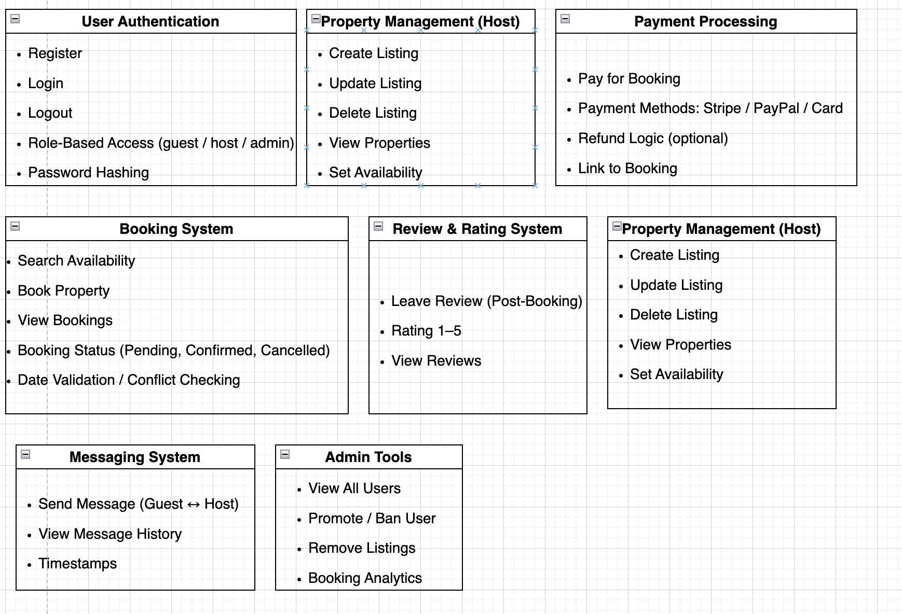

# 🏡 Airbnb Clone – Backend Features & Functionalities

This document outlines the **key features and functionalities** of the Airbnb Clone backend system, designed to support a seamless user experience for guests, hosts, and administrators.

---

## 📌 Objective

To clearly define and visualize the backend capabilities of the Airbnb Clone project. A system diagram has been created using Draw.io to complement this document.

---

## 🖼️ System Design Overview

- ✅ **User Authentication**
  - Sign up / Register (guest, host, admin)
  - Secure login / logout
  - Password encryption (bcrypt or similar)
  - Role-based access control

- 🏠 **Property Management**
  - Create, update, delete listings (hosts only)
  - Property details: name, description, location, price
  - Image uploads (if supported)
  - Availability status management

- 📅 **Booking System**
  - Guests can browse and book properties
  - Start and end date validation
  - Booking status: pending, confirmed, canceled
  - Hosts can approve/reject bookings
  - Conflict and overlap checks

- 💳 **Payment Integration**
  - Payment processing via credit card, PayPal, Stripe
  - Link payments to bookings
  - Store payment metadata (method, amount, timestamp)
  - Refund and cancellation policy logic

- 🌟 **Review System**
  - Guests can leave reviews and ratings (1–5)
  - Only after confirmed booking completion
  - Hosts can view feedback

- ✉️ **Messaging System**
  - Guest ↔ Host communication (direct messaging)
  - Track sender, recipient, and timestamps
  - Message persistence and history

- ⚙️ **Admin Features**
  - User management: view, promote, deactivate users
  - Property moderation
  - Booking insights and reporting

---

## 🧩 Technical Highlights

- **UUIDs** for unique entity identification
- **Timestamp tracking** for auditing and sorting
- **Foreign keys** for relational integrity
- **3NF-compliant database schema**
- Scalable, modular design suitable for REST API integration

---
