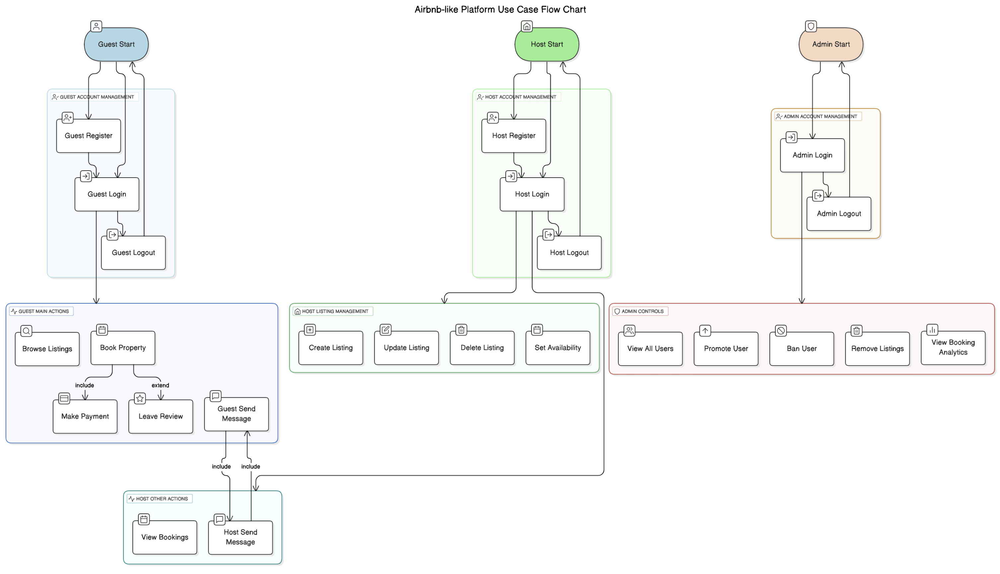

# Airbnb Clone - Use Case Diagram

This directory contains the use case diagram for the backend of the Airbnb clone project.

## 📌 Description

The diagram visualizes interactions between the main actors and the system:

- **Guest:** Register, login, browse listings, book properties, make payments, leave reviews, and send messages.
- **Host:** Manage listings, communicate with guests.
- **Admin:** Oversee the platform, manage users and listings.

## 🖼 Diagram

